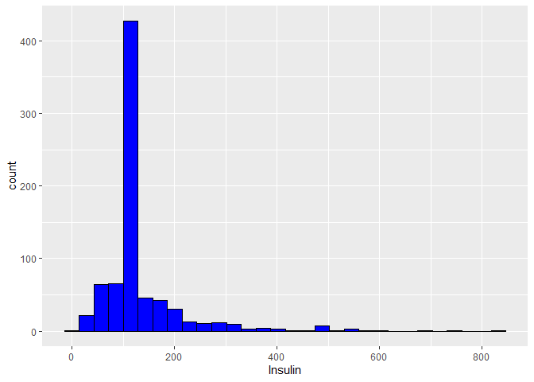
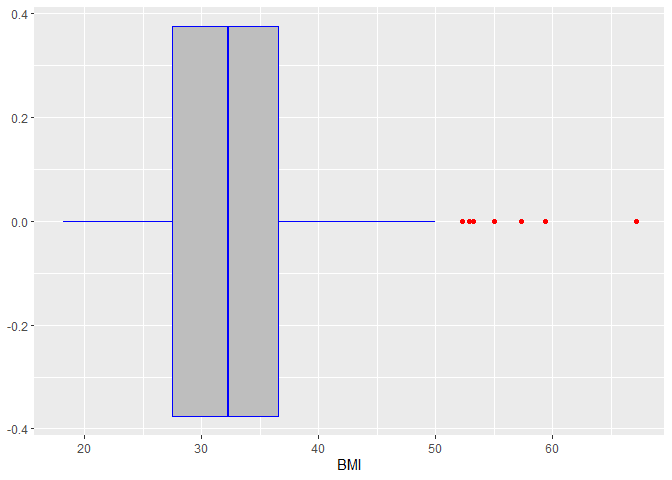

Gestational Diabetes Prediciton Project
================
Daniel Audi
6/20/2022

- Project outline The project goal as a data scientist working at a
  hospital, is to develop a model to identify pregnant women with a
  greater likelihood of developing gestational diabetes.Given that the
  outcome will be a positive or negative diagnosis, this falls under the
  category of classification machine learning algorithms.
- Data description The dataset inovles data on women at least 21 years
  of age and contains the following variables: • Pregnancies: Number of
  times pregnant • Glucose: Plasma glucose concentration 2 hours after
  an oral glucose tolerance test • BloodPressure: Diastolic blood
  pressure (mm Hg) • SkinThickness: Triceps skin fold thickness (mm) •
  Insulin: 2-Hour serum insulin (mu U/ml) • BMI: Body mass index (BMI =
  weight (kg) / height (m)2) • Pedigree: Diabetes pedigree function •
  Age: Age (years) • Diagnosis: Class (diabetes/not diabetes, 1,0) The
  target variable is the diagnosis while all the others are independent
  variables (features)

``` r
knitr::opts_chunk$set(fig.path = "README_figs/README-")
require(ggplot2)
```

    ## Loading required package: ggplot2

``` r
library(dplyr)
```

    ## 
    ## Attaching package: 'dplyr'

    ## The following objects are masked from 'package:stats':
    ## 
    ##     filter, lag

    ## The following objects are masked from 'package:base':
    ## 
    ##     intersect, setdiff, setequal, union

``` r
library(caret)
```

    ## Loading required package: lattice

``` r
# Import the dataset
patients <- read.csv("data/patients.csv")

# Generate the summary statistics for each variable
summary(patients)
```

    ##   Pregnancies        Glucose      BloodPressure    SkinThickness  
    ##  Min.   : 0.000   Min.   :  0.0   Min.   :  0.00   Min.   : 0.00  
    ##  1st Qu.: 1.000   1st Qu.: 99.0   1st Qu.: 62.00   1st Qu.: 0.00  
    ##  Median : 3.000   Median :117.0   Median : 72.00   Median :23.00  
    ##  Mean   : 3.845   Mean   :120.9   Mean   : 69.11   Mean   :20.54  
    ##  3rd Qu.: 6.000   3rd Qu.:140.2   3rd Qu.: 80.00   3rd Qu.:32.00  
    ##  Max.   :17.000   Max.   :199.0   Max.   :122.00   Max.   :99.00  
    ##     Insulin           BMI           Pedigree           Age       
    ##  Min.   :  0.0   Min.   : 0.00   Min.   :0.0780   Min.   :21.00  
    ##  1st Qu.:  0.0   1st Qu.:27.30   1st Qu.:0.2437   1st Qu.:24.00  
    ##  Median : 30.5   Median :32.00   Median :0.3725   Median :29.00  
    ##  Mean   : 79.8   Mean   :31.99   Mean   :0.4719   Mean   :33.24  
    ##  3rd Qu.:127.2   3rd Qu.:36.60   3rd Qu.:0.6262   3rd Qu.:41.00  
    ##  Max.   :846.0   Max.   :67.10   Max.   :2.4200   Max.   :81.00  
    ##    Diagnosis    
    ##  Min.   :0.000  
    ##  1st Qu.:0.000  
    ##  Median :0.000  
    ##  Mean   :0.349  
    ##  3rd Qu.:1.000  
    ##  Max.   :1.000

``` r
# Display the  first few rows of the dataset
head(patients)
```

    ##   Pregnancies Glucose BloodPressure SkinThickness Insulin  BMI Pedigree Age
    ## 1           6     148            72            35       0 33.6    0.627  50
    ## 2           1      85            66            29       0 26.6    0.351  31
    ## 3           8     183            64             0       0 23.3    0.672  32
    ## 4           1      89            66            23      94 28.1    0.167  21
    ## 5           0     137            40            35     168 43.1    2.288  33
    ## 6           5     116            74             0       0 25.6    0.201  30
    ##   Diagnosis
    ## 1         1
    ## 2         0
    ## 3         1
    ## 4         0
    ## 5         1
    ## 6         0

### MIssingness Map

``` r
# Use the Amelia library to generate the missingness map for the data
library(Amelia)
```

    ## Loading required package: Rcpp

    ## ## 
    ## ## Amelia II: Multiple Imputation
    ## ## (Version 1.8.0, built: 2021-05-26)
    ## ## Copyright (C) 2005-2023 James Honaker, Gary King and Matthew Blackwell
    ## ## Refer to http://gking.harvard.edu/amelia/ for more information
    ## ##

``` r
patients.missing <- patients[, 1:8] %>%
  mutate(Pregnancies = replace(Pregnancies, Pregnancies == 0, NA)) %>%
  mutate(Glucose = replace(Glucose, Glucose == 0, NA)) %>%
  mutate(BloodPressure = replace(BloodPressure, BloodPressure == 0, NA)) %>%
  mutate(SkinThickness = replace(SkinThickness, SkinThickness == 0, NA)) %>%
  mutate(Insulin = replace(Insulin, Insulin == 0, NA)) %>%
  mutate(BMI = replace(BMI, BMI == 0, NA)) %>%
  mutate(Pedigree = replace(Pedigree, Pedigree == 0, NA)) %>%
  mutate(Age = replace(Age, Age == 0, NA))
missmap(patients.missing)
```

<!-- -->

## Filling missing values with the median

``` r
# Replacing the 0 values with NA 
patients.clean <- patients %>%
  mutate(Pregnancies = replace(Pregnancies, Pregnancies == 0, NA)) %>%
  mutate(Glucose = replace(Glucose, Glucose == 0, NA)) %>%
  mutate(BloodPressure = replace(BloodPressure, BloodPressure == 0, NA)) %>%
  mutate(SkinThickness = replace(SkinThickness, SkinThickness == 0, NA)) %>%
  mutate(Insulin = replace(Insulin, Insulin == 0, NA)) %>%
  mutate(BMI = replace(BMI, BMI == 0, NA)) %>%
  mutate(Pedigree = replace(Pedigree, Pedigree == 0, NA)) %>%
  mutate(Age = replace(Age, Age == 0, NA))
```

### Pregnancies

``` r
patients.clean$Pregnancies[is.na(patients.clean$Pregnancies)]<-median(patients.clean$Pregnancies,na.rm=TRUE)
```

### Glucose

``` r
patients.clean$Glucose[is.na(patients.clean$Glucose)]<-median(patients.clean$Glucose,na.rm=TRUE)
```

### Blood Pressure

``` r
patients.clean$BloodPressure[is.na(patients.clean$BloodPressure)]<-median(patients.clean$BloodPressure,na.rm=TRUE)
```

### Skin Thickness

``` r
patients.clean$SkinThickness[is.na(patients.clean$SkinThickness)]<-median(patients.clean$SkinThickness,na.rm=TRUE)
```

### Insulin

``` r
patients.clean$Insulin[is.na(patients.clean$Insulin)]<-median(patients.clean$Insulin,na.rm=TRUE)
```

### BMI

``` r
patients.clean$BMI[is.na(patients.clean$BMI)]<-median(patients.clean$BMI,na.rm=TRUE)
```

### Pedigree

``` r
patients.clean$Pedigree[is.na(patients.clean$Pedigree)]<-median(patients.clean$Pedigree,na.rm=TRUE)
```

### Age

``` r
patients.clean$Age[is.na(patients.clean$Age)]<-median(patients.clean$Age,na.rm=TRUE)
```

### Plot missingness map to show that there are no missing values

``` r
missmap(patients.clean)
```

<!-- -->

\##Plot histograms of the data to show distribution and boxplots to show
outliers This is an exploratory data analysis to see the distribution of
the data and the outliers in the dataset

### Histogram and boxplot of pregnancies:

``` r
library(ggplot2)

# plot histogram
ggplot(patients.clean, aes(x = Pregnancies)) + geom_histogram(fill = "blue", color = "black")
```

    ## `stat_bin()` using `bins = 30`. Pick better value with `binwidth`.

<!-- -->

``` r
#plot boxplot to visualize outliers
ggplot(patients.clean, aes(x = Pregnancies)) + geom_boxplot(color = "blue", fill = "grey", outlier.color = "red")
```

<!-- -->

``` r
#Using IQR to calculate the threshold for outliers and imputing the median
upperPreg <- quantile(patients.clean$Pregnancies, 0.75)+(1.5*IQR(patients.clean$Pregnancies))
patients.clean.outliers <- patients.clean %>%
  mutate(Pregnancies = replace(Pregnancies, Pregnancies > upperPreg, median(Pregnancies)))

#plot boxplot to confirm if all outliers have been dealt with
ggplot(patients.clean.outliers, aes(x = Pregnancies)) + geom_boxplot(color = "blue", fill = "grey", outlier.color = "red")
```

<!-- -->

### Histogram and boxplot of Glucose

Glucose had no outliers

``` r
ggplot(patients.clean, aes(x = Glucose)) + geom_histogram(fill = "blue", color = "black")
```

    ## `stat_bin()` using `bins = 30`. Pick better value with `binwidth`.

<!-- -->

``` r
ggplot(patients.clean, aes(x = Glucose)) + geom_boxplot(color = "blue", fill = "grey", outlier.color = "red")
```

<!-- -->

``` r
upperGluc <- quantile(patients.clean$Glucose, 0.75)+(1.5*IQR(patients.clean$Glucose))
lowerGluc <- quantile(patients.clean$Glucose, 0.25)-(1.5*IQR(patients.clean$Glucose))
patients.clean.outliers <- patients.clean %>%
  mutate(Glucose = replace(Glucose, Glucose > upperGluc, median(Glucose))) %>%
  mutate(Glucose = replace(Glucose, Glucose < lowerGluc, median(Glucose)))
ggplot(patients.clean.outliers, aes(x = Glucose)) + geom_boxplot(color = "blue", fill = "grey", outlier.color = "red")
```

<!-- -->

### Histogram and boxplot of BloodPressure

``` r
ggplot(patients.clean, aes(x = BloodPressure)) + geom_histogram(fill = "blue", color = "black")
```

    ## `stat_bin()` using `bins = 30`. Pick better value with `binwidth`.

<!-- -->

``` r
ggplot(patients.clean, aes(x = BloodPressure)) + geom_boxplot(color = "blue", fill = "grey", outlier.color = "red")
```

<!-- -->

``` r
upperBP <- quantile(patients.clean$BloodPressure, 0.75)+(1.5*IQR(patients.clean$BloodPressure))
lowerBP <- quantile(patients.clean$BloodPressure, 0.25)-(1.5*IQR(patients.clean$BloodPressure))
patients.clean.outliers <- patients.clean %>%
  mutate(BloodPressure = replace(BloodPressure, BloodPressure > upperBP, median(BloodPressure))) %>%
  mutate(BloodPressure = replace(BloodPressure, BloodPressure < lowerBP, median(BloodPressure)))

ggplot(patients.clean.outliers, aes(x = BloodPressure)) + geom_boxplot(color = "blue", fill = "grey", outlier.color = "red")
```

<!-- --> \### Histogram
and boxplot of Skin Thickness

``` r
ggplot(patients.clean, aes(x = SkinThickness)) + geom_histogram(fill = "blue", color = "black")
```

    ## `stat_bin()` using `bins = 30`. Pick better value with `binwidth`.

<!-- -->

``` r
ggplot(patients.clean, aes(x = SkinThickness)) + geom_boxplot(color = "blue", fill = "grey", outlier.color = "red")
```

<!-- -->

``` r
upperSK <- quantile(patients.clean$SkinThickness, 0.75)+(1.5*IQR(patients.clean$SkinThickness))
lowerSK <- quantile(patients.clean$SkinThickness, 0.25)-(1.5*IQR(patients.clean$SkinThickness))
patients.clean.outliers <- patients.clean %>%
  mutate(SkinThickness = replace(SkinThickness, SkinThickness > upperSK, median(SkinThickness))) %>%
  mutate(SkinThickness = replace(SkinThickness, SkinThickness < lowerSK, median(SkinThickness)))
ggplot(patients.clean.outliers, aes(x = SkinThickness)) + geom_boxplot(color = "blue", fill = "grey", outlier.color = "red")
```

<!-- -->

### Histogram and boxplot of Insulin

``` r
ggplot(patients.clean, aes(x = Insulin)) + geom_histogram(fill = "blue", color = "black")
```

    ## `stat_bin()` using `bins = 30`. Pick better value with `binwidth`.

<!-- -->

``` r
ggplot(patients.clean, aes(x = Insulin)) + geom_boxplot(color = "blue", fill = "grey", outlier.color = "red")
```

<!-- -->

``` r
upperIns <- quantile(patients.clean$Insulin, 0.75)+(1.5*IQR(patients.clean$Insulin))
lowerIns <- quantile(patients.clean$Insulin, 0.25)-(1.5*IQR(patients.clean$Insulin))
patients.clean.outliers <- patients.clean %>%
  mutate(Insulin = replace(Insulin, Insulin > upperIns, median(Insulin))) %>%
  mutate(Insulin = replace(Insulin, Insulin < lowerIns, median(Insulin)))
ggplot(patients.clean.outliers, aes(x = Insulin)) + geom_boxplot(color = "blue", fill = "grey", outlier.color = "red")
```

<!-- -->

### Histogram and boxplot of BMI

``` r
ggplot(patients.clean, aes(x = BMI)) + geom_histogram(fill = "blue", color = "black")
```

    ## `stat_bin()` using `bins = 30`. Pick better value with `binwidth`.

<!-- -->

``` r
ggplot(patients.clean, aes(x = BMI)) + geom_boxplot(color = "blue", fill = "grey", outlier.color = "red")
```

<!-- -->

``` r
upperBMI <- quantile(patients.clean$BMI, 0.75)+(1.5*IQR(patients.clean$BMI))
lowerBMI <- quantile(patients.clean$BMI, 0.25)-(1.5*IQR(patients.clean$BMI))
patients.clean.outliers <- patients.clean %>%
  mutate(BMI = replace(BMI, BMI > upperBMI, median(BMI))) %>%
  mutate(BMI = replace(BMI, BMI < lowerBMI, median(BMI)))
ggplot(patients.clean.outliers, aes(x = BMI)) + geom_boxplot(color = "blue", fill = "grey", outlier.color = "red")
```

<!-- -->

### Histogram and boxplot of Pedigree

``` r
ggplot(patients.clean, aes(x = Pedigree)) + geom_histogram(fill = "blue", color = "black")
```

    ## `stat_bin()` using `bins = 30`. Pick better value with `binwidth`.

<!-- -->

``` r
ggplot(patients.clean, aes(x = Pedigree)) + geom_boxplot(color = "blue", fill = "grey", outlier.color = "red")
```

<!-- -->

``` r
upperPd <- quantile(patients.clean$Pedigree, 0.75)+(1.5*IQR(patients.clean$Pedigree))
lowerPd <- quantile(patients.clean$Pedigree, 0.25)-(1.5*IQR(patients.clean$Pedigree))
patients.clean.outliers <- patients.clean %>%
  mutate(Pedigree = replace(Pedigree, Pedigree >= upperPd, median(Pedigree))) %>%
  mutate(Pedigree = replace(Pedigree, Pedigree <= lowerPd, median(Pedigree)))
ggplot(patients.clean.outliers, aes(x = Pedigree)) + geom_boxplot(color = "blue", fill = "grey", outlier.color = "red")
```

<!-- -->

### Histogram and boxplot of Age

``` r
ggplot(patients.clean, aes(x = Age)) + geom_histogram(fill = "blue", color = "black")
```

    ## `stat_bin()` using `bins = 30`. Pick better value with `binwidth`.

<!-- -->

``` r
ggplot(patients.clean, aes(x = Age)) + geom_boxplot(color = "blue", fill = "grey", outlier.color = "red")
```

<!-- -->

``` r
upperAge <- quantile(patients.clean$Age, 0.75)+(1.5*IQR(patients.clean$Age))
lowerAge <- quantile(patients.clean$Age, 0.25)-(1.5*IQR(patients.clean$Age))
patients.clean.outliers <- patients.clean %>%
  mutate(Age = replace(Age, Age >= upperAge, median(Age))) %>%
  mutate(Age = replace(Age, Age <= lowerAge, median(Age)))
ggplot(patients.clean.outliers, aes(x = Age)) + geom_boxplot(color = "blue", fill = "grey", outlier.color = "red")
```

<!-- -->

### Correlogram to select features

``` r
library(corrgram)
```

    ## 
    ## Attaching package: 'corrgram'

    ## The following object is masked from 'package:lattice':
    ## 
    ##     panel.fill

``` r
corrgram(patients.clean.outliers[1:8], order=TRUE, lower.panel=panel.shade, upper.panel=NULL, text.panel=panel.txt, main="Correlogram of features")
```

<!-- --> Pregnancies and
Age are highly correlated, as are SkinThickness and BMI. Therefore when
selecting the features, Age and SkinThickness will be dropped, keeping
Pregnancies and BMI. Further analysis will be done to further select the
features using a regression model.

### Standardize features to a gaussian distribution

``` r
standardize = function(x){
  z.score <- x - mean(x) / sd(x)
  return(z.score)
}

patients.clean.outliers[1:8] <- apply(patients.clean.outliers[1:8], 2, standardize)
patients.clean.outliers$Diagnosis = as.factor(patients.clean.outliers$Diagnosis)
std.patients.final = patients.clean.outliers
```

### Logistic Regression model

``` r
library(caTools)

# To ensure reproducibiity
set.seed(143)

#Split the dataset into train and test data
sample <- sample.split(std.patients.final$Diagnosis, SplitRatio = 0.8)
train <- subset(std.patients.final, sample==TRUE)
test <- subset(std.patients.final, sample==FALSE)

train_control <- trainControl(method="cv", number=10, savePredictions = "all", classProbs = FALSE)

# Check the dimensions of the train and test data
dim(train)
```

    ## [1] 614   9

``` r
dim(test)
```

    ## [1] 154   9

### feature selection for the model using regression

``` r
selection = glm(Diagnosis ~ ., data = std.patients.final, family = 'binomial')
summary(selection)
```

    ## 
    ## Call:
    ## glm(formula = Diagnosis ~ ., family = "binomial", data = std.patients.final)
    ## 
    ## Deviance Residuals: 
    ##     Min       1Q   Median       3Q      Max  
    ## -2.5829  -0.6974  -0.3948   0.6944   2.4022  
    ## 
    ## Coefficients:
    ##                Estimate Std. Error z value Pr(>|z|)    
    ## (Intercept)   -7.182924   0.787719  -9.119  < 2e-16 ***
    ## Pregnancies    0.128560   0.036414   3.530 0.000415 ***
    ## Glucose        0.037473   0.003888   9.637  < 2e-16 ***
    ## BloodPressure -0.012202   0.008642  -1.412 0.157947    
    ## SkinThickness  0.002889   0.013260   0.218 0.827536    
    ## Insulin       -0.001167   0.001142  -1.022 0.306953    
    ## BMI            0.092621   0.017861   5.186 2.15e-07 ***
    ## Pedigree       0.867490   0.299097   2.900 0.003727 ** 
    ## Age            0.022932   0.009924   2.311 0.020848 *  
    ## ---
    ## Signif. codes:  0 '***' 0.001 '**' 0.01 '*' 0.05 '.' 0.1 ' ' 1
    ## 
    ## (Dispersion parameter for binomial family taken to be 1)
    ## 
    ##     Null deviance: 993.48  on 767  degrees of freedom
    ## Residual deviance: 709.24  on 759  degrees of freedom
    ## AIC: 727.24
    ## 
    ## Number of Fisher Scoring iterations: 5

From the analysis above, the following features will be the best for our
model, denoted by the asterisks:
<li>
Pregnancies
</li>
<li>
Glucose
</li>
<li>
BMI
</li>
<li>
Pedigree
</li>

While Age has also been selected, from the correlogram, it is highly
correlated with Pregnancies. This will cause greater fluctuations in our
model and therefore we drop Age. The selected features will be
Pregnancies, Glucose, BMI and Pedigree

### Logistic Regression model with selected features

``` r
set.seed(143)

# Training the model with selected features
LRM.selected = train(Diagnosis ~ Pregnancies + Glucose + BMI + Pedigree, data = train, trControl=train_control, family = 'binomial', method="glm", metric="Accuracy")

# Model metrics
summary(LRM.selected)
```

    ## 
    ## Call:
    ## NULL
    ## 
    ## Deviance Residuals: 
    ##     Min       1Q   Median       3Q      Max  
    ## -2.9314  -0.7017  -0.3656   0.6189   2.5508  
    ## 
    ## Coefficients:
    ##              Estimate Std. Error z value Pr(>|z|)    
    ## (Intercept) -7.634307   0.798068  -9.566  < 2e-16 ***
    ## Pregnancies  0.172882   0.035737   4.838 1.31e-06 ***
    ## Glucose      0.040098   0.004047   9.908  < 2e-16 ***
    ## BMI          0.089265   0.016866   5.293 1.21e-07 ***
    ## Pedigree     0.981977   0.342773   2.865  0.00417 ** 
    ## ---
    ## Signif. codes:  0 '***' 0.001 '**' 0.01 '*' 0.05 '.' 0.1 ' ' 1
    ## 
    ## (Dispersion parameter for binomial family taken to be 1)
    ## 
    ##     Null deviance: 793.94  on 613  degrees of freedom
    ## Residual deviance: 551.88  on 609  degrees of freedom
    ## AIC: 561.88
    ## 
    ## Number of Fisher Scoring iterations: 5

``` r
LRM.selected
```

    ## Generalized Linear Model 
    ## 
    ## 614 samples
    ##   4 predictor
    ##   2 classes: '0', '1' 
    ## 
    ## No pre-processing
    ## Resampling: Cross-Validated (10 fold) 
    ## Summary of sample sizes: 553, 552, 553, 552, 552, 553, ... 
    ## Resampling results:
    ## 
    ##   Accuracy   Kappa    
    ##   0.7900053  0.5166023

``` r
# Variable importance
varImp(LRM.selected)
```

    ## glm variable importance
    ## 
    ##             Overall
    ## Glucose      100.00
    ## BMI           34.47
    ## Pregnancies   28.01
    ## Pedigree       0.00

### Logistic Regression model with all features

``` r
set.seed(143)

# Training the model
LRM.all = train(Diagnosis ~ ., data = train, trControl=train_control, family = binomial, method="glm", metric="Accuracy")

# Model metrics
summary(LRM.all)
```

    ## 
    ## Call:
    ## NULL
    ## 
    ## Deviance Residuals: 
    ##     Min       1Q   Median       3Q      Max  
    ## -2.5986  -0.6868  -0.3661   0.6099   2.4723  
    ## 
    ## Coefficients:
    ##                Estimate Std. Error z value Pr(>|z|)    
    ## (Intercept)   -7.620705   0.929296  -8.201 2.39e-16 ***
    ## Pregnancies    0.151023   0.042161   3.582 0.000341 ***
    ## Glucose        0.044012   0.004715   9.334  < 2e-16 ***
    ## BloodPressure -0.013585   0.009897  -1.373 0.169860    
    ## SkinThickness  0.009002   0.015316   0.588 0.556692    
    ## Insulin       -0.002860   0.001262  -2.267 0.023373 *  
    ## BMI            0.097336   0.020650   4.714 2.43e-06 ***
    ## Pedigree       1.009069   0.345426   2.921 0.003486 ** 
    ## Age            0.014870   0.011340   1.311 0.189775    
    ## ---
    ## Signif. codes:  0 '***' 0.001 '**' 0.01 '*' 0.05 '.' 0.1 ' ' 1
    ## 
    ## (Dispersion parameter for binomial family taken to be 1)
    ## 
    ##     Null deviance: 793.94  on 613  degrees of freedom
    ## Residual deviance: 544.01  on 605  degrees of freedom
    ## AIC: 562.01
    ## 
    ## Number of Fisher Scoring iterations: 5

``` r
LRM.all
```

    ## Generalized Linear Model 
    ## 
    ## 614 samples
    ##   8 predictor
    ##   2 classes: '0', '1' 
    ## 
    ## No pre-processing
    ## Resampling: Cross-Validated (10 fold) 
    ## Summary of sample sizes: 553, 552, 553, 552, 552, 553, ... 
    ## Resampling results:
    ## 
    ##   Accuracy   Kappa    
    ##   0.7867266  0.5038007

``` r
# Variable importance
varImp(LRM.all)
```

    ## glm variable importance
    ## 
    ##               Overall
    ## Glucose       100.000
    ## BMI            47.171
    ## Pregnancies    34.233
    ## Pedigree       26.679
    ## Insulin        19.202
    ## BloodPressure   8.974
    ## Age             8.272
    ## SkinThickness   0.000

kappa values .81-1 Almost perfect .61 - .8 Substantial .41 - .6 Moderate
.21 - .4 Fair .00 - .2 Slight \< 0 Poor

odds ratios (log odds)

### Classification report and accuracy score of the models

Starting with the model with preselected features

``` r
# Make predictions using the test data
prediction.selected <- predict(LRM.selected, newdata = test)

# Generate the confusion matrix for the model
result.selected = confusionMatrix(prediction.selected, test$Diagnosis, positive = "1")
result.selected
```

    ## Confusion Matrix and Statistics
    ## 
    ##           Reference
    ## Prediction  0  1
    ##          0 85 27
    ##          1 15 27
    ##                                           
    ##                Accuracy : 0.7273          
    ##                  95% CI : (0.6497, 0.7958)
    ##     No Information Rate : 0.6494          
    ##     P-Value [Acc > NIR] : 0.02443         
    ##                                           
    ##                   Kappa : 0.3689          
    ##                                           
    ##  Mcnemar's Test P-Value : 0.08963         
    ##                                           
    ##             Sensitivity : 0.5000          
    ##             Specificity : 0.8500          
    ##          Pos Pred Value : 0.6429          
    ##          Neg Pred Value : 0.7589          
    ##              Prevalence : 0.3506          
    ##          Detection Rate : 0.1753          
    ##    Detection Prevalence : 0.2727          
    ##       Balanced Accuracy : 0.6750          
    ##                                           
    ##        'Positive' Class : 1               
    ## 

Next, the model with all the features

``` r
prediction.all <- predict(LRM.all, newdata = test)

result.all = confusionMatrix(prediction.all, test$Diagnosis, positive = "1")
result.all
```

    ## Confusion Matrix and Statistics
    ## 
    ##           Reference
    ## Prediction  0  1
    ##          0 83 27
    ##          1 17 27
    ##                                          
    ##                Accuracy : 0.7143         
    ##                  95% CI : (0.636, 0.7841)
    ##     No Information Rate : 0.6494         
    ##     P-Value [Acc > NIR] : 0.05265        
    ##                                          
    ##                   Kappa : 0.3447         
    ##                                          
    ##  Mcnemar's Test P-Value : 0.17484        
    ##                                          
    ##             Sensitivity : 0.5000         
    ##             Specificity : 0.8300         
    ##          Pos Pred Value : 0.6136         
    ##          Neg Pred Value : 0.7545         
    ##              Prevalence : 0.3506         
    ##          Detection Rate : 0.1753         
    ##    Detection Prevalence : 0.2857         
    ##       Balanced Accuracy : 0.6650         
    ##                                          
    ##        'Positive' Class : 1              
    ## 
